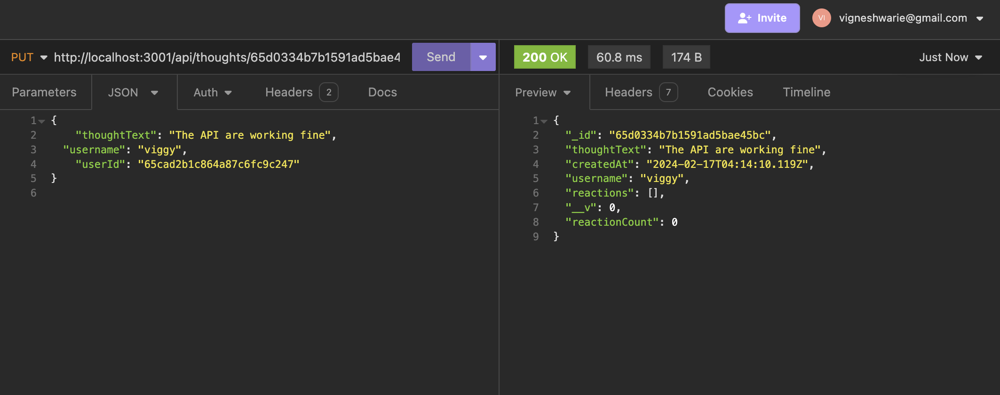

# vs-connecting-people

## Description

vs-connecting-people is an API for a social networking application that allows people to create new users, add new friends, and share their thoughts and reactions to other's thoughts. The application handles all the user requests as API requests using Express.js and stores the data in MongoDB. The application uses the Mongoose library to access the data for its API and is tested on Insomnia.

## Installation

To run or execute the application locally, one must have node installed in the system and other supporting packages like express.js, mongoose, etc as mentioned in the package.json file.

To individually install the packages, use the below links,

Follow the guidelines using the link to install Node.js: https://nodejs.org/en/learn/getting-started/how-to-install-nodejs, 

Follow the guidelines using the link to install Express.js: https://www.npmjs.com/package/express

## Usage

The application source code can be accessed using the link https://github.com/Vigneshwarie/vs-connecting-people

One can download the code from the above link. To use the application, one must install all node.js, express.js, and other packages, as mentioned in the installation section, or one can follow the package.json file and use the npm install command. Sample data is included in the utils folder and can be seeded using the "npm run seed" command.

Once completed, navigate to the application folder and run the server.js file in the integrated terminal of vscode. Use the command below to the file,

application-folder> node server.js

On successful installation and execution, the application will run successfully and start listening to the port. One can navigate to Insomnia or other API testing platforms to test the APIs.  

Upon successful API execution, the application shall display the data below.

### User APIs

### Thoughts APIs

## Credits

The links below helped me understand the issues during development.

https://stackoverflow.com/questions/26252569/mongoose-delete-subdocument-array-item

https://stackoverflow.com/questions/26818071/mongoose-schema-hasnt-been-registered-for-model

## License

Please refer to the LICENSE in the repo.